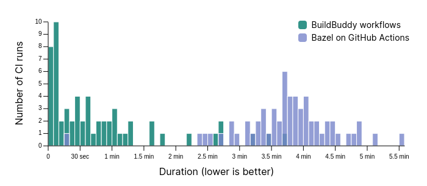

In our [latest release](TODO/LINK_TO_RELEASE_POST), we launched BuildBuddy
Workflows, a Continuous Integration (CI) solution for Bazel repositories
hosted on GitHub.

Like other CI solutions, workflows give you the confidence that your code
builds successfully and passes all tests before you merge pull requests or
deploy a new release.

But because BuildBuddy workflows are optimized for Bazel repos and closely
integrated with BuildBuddy services, they are _really fast_.

## How fast are BuildBuddy workflows?

We've used BuildBuddy workflows on our own source repositories for the past few
months, comparing them side-by-side with our existing CI solution.

By leveraging Bazel's local caching as well as BuildBuddy's
remote caching and execution, workflows dramatically sped up our CI runs.
Compared to our previous solution, we reduced the median duration by about
**7X**, with half of all builds executing in 30 seconds or less (compare
to 3 minutes and 30 seconds).

This overlapping histogram chart shows the complete picture: on our repo,
BuildBuddy workflows rarely took longer than a minute. With our old
solution built on GitHub Actions, almost all builds took more than a minute,
with most builds taking 3 and a half minutes or longer.

## Why does fast CI matter?

So, BuildBuddy workflows are fast. But do we really need faster CI?
Does it really matter if a workflow takes 30 seconds vs. 4 minutes?

Like many other modern source repositories built with Bazel, the [BuildBuddy repo](https://github.com/buildbuddy-io/buildbuddy)
is fairly large, and has many external dependencies. It's important for us
(and to our users) to be able to quickly iterate, even as our repo's code
size scales up.

Before we allow new code to be a part of the product, we use CI to ensure that
all of our tests pass, so that we can be more confident that the code does not
introduce any regressions.

And if CI runs don't complete quickly, developers are inclined to
"context switch" &mdash; meaning they stop waiting for CI and start working
on something else. Even for the most disciplined developers who are great at multitasking, this
can introduce mental overhead and result in less productivity overall.

The developer experience when CI is **slow** looks a bit like this (red parts of the
timeline indicate lost productivity):

The experience when CI is **fast** looks more like this:

## How did we make workflows fast?

In addition to convenience and security, one of our main goals for workflows
was to maximize performance, even for very large source repositories.

We did this in two main ways:

1. Ensure a **fast network connection to BuildBuddy's servers**.
2. Run workflow actions in a **persistent sandbox environment**.

### Fast connection to BuildBuddy

For users taking advantage of BuildBuddy's remote cache and remote
execution system, it's crucial to ensure that we run workflows very close
to BuildBuddy's servers.

This means that if we need to fetch something from BuildBuddy's cache, or
we need to build a particular target remotely, network latency and
bandwidth will not be a major bottleneck.

The solution here was simple: run workflows on a dedicated executor
deployment in the same datacenter where BuildBuddy is deployed.

With GitHub actions or other CI solutions, the network connection might
be fast (especially after the recent network optimizations we made in
[BuildBuddy v2](introducing-buildbuddy-v2)) &mdash; but not nearly as fast
as having the workflow runner on the same local network as BuildBuddy
itself.

### Sandbox persistence

In [BuildBuddy v2](introducing-buildbuddy-v2#sandboxing), we announced
improvements to our remote build execution system that allow us to re-use
sandbox environments across build actions.

For workflows, this new functionality is especially useful. Instead of creating
a new Docker container each time we build a repository, we
try to reuse a container that previously built the repository. This has
several advantages:

- Whenever a new commit is pushed, we only need to fetch the diffs,
  and not re-clone the whole repo.
- We don't need to start a new bazel server each time, meaning that
  we can re-use the analysis cache from the previous build. Roughly,
  this means that Bazel doesn't have to construct the full build graph by
  parsing all the BUILD files in your repo, because it has the build graph
  in memory. This also means that if you specify a `.bazelversion`, we don't
  need to download and install your requested bazel version each time.
- The development environment keeps the local bazel cache around, meaning
  that we don't need to make as many calls to the remote cache. Our
  remote caching infrastructure is fast, but the on-disk bazel cache
  is faster.

## How do I use workflows?

Get started with BuildBuddy workflows by checking out our [setup guide](/docs/workflows-setup/).
If you've already linked your GitHub account to BuildBuddy, it'll only take
about 30 seconds to enable workflows for your repo &mdash; just select a repo
to link, and we take care of the rest!

As always, message us on [Slack](https://buildbuddy.slack.com) or
[file an issue](https://github.com/buildbuddy-io/buildbuddy/issues/new)
if you need help, run into any issues, or have feature requests!
